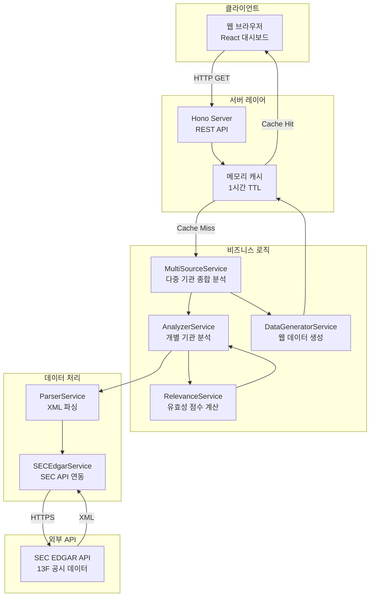

# 🚀 Mars Dashboard

SEC EDGAR에서 13F 파일을 수집하여 대형 기관 투자자들의 포트폴리오 변화를 분석하고 투자 시그널을 생성하는 대시보드입니다.

> **형님들 뭐 샀나 훔쳐보기** - 여러 기관의 투자 움직임을 한눈에 파악하세요.

## 프로젝트 개요

이 프로젝트는 SEC EDGAR의 13F 공시 데이터를 분석하여 다음과 같은 정보를 제공합니다.

- **다중 기관 종합 분석**: 여러 기관의 매수/매도 신호를 종합하여 합의 점수 계산
- **기관별 포트폴리오 추적**: 버크셔 해서웨이, 국민연금 등 18개 기관 추적
- **신규 편입 종목 감지**: 기관이 새로 매수한 종목 식별
- **연속 분기 변화 추적**: 연속 매수/매도 패턴 분석
- **유효성 점수**: 현재 시점에서 매수 시그널의 유효성 평가
- **Watchlist 및 Exclusion List**: 자동 생성된 투자 후보 및 주의 종목

## 주요 기능

### 종합 분석 (Synthetic Analysis)
- **종합 매수 신호**: 여러 기관이 동시에 매수하는 종목
- **종합 매도 신호**: 여러 기관이 동시에 매도하는 종목
- **합의 점수**: 기관 수, 평균 유효성, 방향 일치도를 종합한 점수 (0-100점)

### 개별 기관 분석
- 13F 파일 자동 수집 및 파싱
- 분기별 포트폴리오 변화 분석
- 연속 분기 변화 추적
- 유효성 점수 기반 필터링

### 웹 대시보드
- 실시간 데이터 시각화
- 반응형 디자인
- 브라우저 캐싱 (24시간)
- 펼치기/접기 기능으로 효율적인 정보 탐색

## 기술 스택

### Backend
- **Node.js**: 런타임 환경
- **TypeScript**: 타입 안전성
- **Hono**: 경량 웹 프레임워크
- **Axios**: HTTP 클라이언트
- **fast-xml-parser**: XML 파싱
- **Winston**: 로깅

### Frontend
- **React 18**: UI 라이브러리
- **Babel Standalone**: JSX 변환
- **Vanilla CSS**: 커스텀 스타일링

## 설치 및 실행

### 필수 조건

- Node.js 16 이상
- npm 또는 pnpm

### 설치

```bash
npm install
```

### 실행

```bash
# 개발 모드 (자동 재시작)
npm run dev

# 프로덕션 모드
npm start

# 빌드 후 실행
npm run build
npm run start:prod
```

서버는 기본적으로 `http://localhost:3000`에서 실행됩니다.

## API 엔드포인트

### 종합 분석 데이터

```
GET /api/signals/combined
```

여러 기관의 데이터를 종합하여 매수/매도 신호를 생성합니다.

응답 예시:
```json
{
  "generatedAt": "2026-02-02T12:00:00.000Z",
  "sources": ["berkshire", "nps", "bridgewater", ...],
  "topBuys": [
    {
      "symbol": "AAPL",
      "consensusScore": 85,
      "buyingCount": 3,
      "sellingCount": 0,
      "reasoning": "3개 기관 매수, 합의점수 85점"
    }
  ],
  "topSells": [...],
  "consensus": [...]
}
```

### 개별 기관 시그널 데이터

```
GET /api/signals/:source
```

소스: `berkshire`, `nps`, `bridgewater`, `pershing`, `greenlight`, `baupost` 등

응답 예시:
```json
{
  "metadata": {
    "source": "Berkshire Hathaway",
    "latestFiling": "2025-11-14",
    "analyzedQuarters": ["2025-11-14", "2025-08-14", ...],
    "totalPositions": 50
  },
  "watchlist": [
    {
      "symbol": "AAPL",
      "signal": "NEW_POSITION",
      "currentShares": 1000000,
      "currentValueK": 150000000,
      "relevance": {
        "relevanceScore": 75,
        "reasoning": "현재 유효한 매수 시그널"
      }
    }
  ],
  "exclusionList": [
    {
      "symbol": "XYZ",
      "reason": "CONSECUTIVE_DECREASE",
      "severity": "HIGH",
      "detail": "2분기 연속 감축"
    }
  ]
}
```

### 데이터 새로고침

```
POST /api/refresh/:source
```

캐시를 무시하고 최신 데이터를 수집합니다.

### 소스 목록

```
GET /api/sources
```

사용 가능한 소스 목록을 반환합니다. 현재 18개 기관을 지원합니다.

## 참고 기관

현재 다음 18개 기관의 데이터를 분석합니다:

- **고신념 투자**: Berkshire Hathaway
- **연기금**: National Pension Service (국민연금)
- **헤지펀드**: Bridgewater Associates, Pershing Square Capital, Greenlight Capital, Baupost Group, Third Point, Elliott Management, Tiger Global Management, Coatue Management, Lone Pine Capital, Viking Global Investors, Appaloosa Management, Soros Fund Management, Renaissance Technologies
- **자산운용사**: T. Rowe Price, Capital Group, Fidelity Management & Research

## 데이터 구조

### 종합 분석

- **topBuys**: 여러 기관이 동시에 매수하는 종목 (최소 2개 기관)
- **topSells**: 여러 기관이 동시에 매도하는 종목 (최소 2개 기관)
- **consensus**: 여러 기관이 공통으로 보유하는 종목 (최소 3개 기관)

### Watchlist

신규 편입 또는 연속 분기 비중 증가 종목이 포함됩니다.

- `NEW_POSITION`: 신규 편입 종목
- `CONSECUTIVE_INCREASE`: 연속 분기 비중 증가 종목
- `ACCUMULATING`: 축적 중인 종목 (유효성 점수 75점 이상)

### Exclusion List

연속 감축 또는 청산된 종목이 포함됩니다.

- `CONSECUTIVE_DECREASE`: 연속 분기 감축 종목
- `LIQUIDATED`: 완전 청산 종목

### 유효성 점수 (Relevance Score)

현재 시점에서 매수 시그널이 유효한 정도를 나타냅니다 (0-100점).

- **75점 이상**: 강한 매수 시그널 (축적 중)
- **50-74점**: 보통 매수 시그널
- **50점 미만**: 약한 매수 시그널

### 합의 점수 (Consensus Score)

여러 기관의 합의 강도를 나타냅니다 (0-100점).

- 기관 수 (최대 40점)
- 평균 유효성 (최대 30점)
- 방향 일치도 (최대 30점)

## 아키텍처

### 시스템 아키텍처 다이어그램



### 프로젝트 구조

```
stock-investment/
├── server.ts              # Hono 서버 및 API
├── index.html             # 웹 대시보드 (React)
├── src/
│   ├── config/            # 설정 파일
│   │   ├── analysis.config.ts  # 분석 상수
│   │   ├── app.config.ts       # 앱 설정
│   │   ├── env.config.ts       # 환경 변수
│   │   └── sources.ts          # 기관 목록
│   ├── services/          # 비즈니스 로직
│   │   ├── analyzer.service.ts      # 개별 기관 분석
│   │   ├── multi-source.service.ts  # 다중 기관 종합 분석
│   │   ├── data-generator.service.ts # 웹 데이터 생성
│   │   ├── parser.service.ts        # XML 파싱
│   │   ├── relevance.service.ts     # 유효성 분석
│   │   └── sec-edgar.service.ts     # SEC API 연동
│   ├── types/             # TypeScript 타입 정의
│   ├── utils/             # 유틸리티 함수
│   └── errors/            # 에러 처리
├── dist/                  # 빌드 출력
└── package.json
```

## 데이터 수집 프로세스

1. SEC EDGAR에서 CIK별 13F 파일 목록 조회
2. 최근 4개 분기 데이터 수집 (병렬 처리)
3. XML 파일 다운로드 및 파싱
4. 종목별 보유 수량 및 시장 가치 집계
5. 분기별 변화 분석 (신규 편입, 증가, 감소, 청산)
6. 연속 분기 변화 추적
7. 유효성 점수 계산
8. 다중 기관 합의 점수 계산
9. Watchlist 및 Exclusion List 생성

## 캐싱 전략

### 서버 캐싱 (메모리 캐시)

**구현 방식:**
- `src/utils/cache.ts`에서 `Record<SourceKey, WebData | null>` 타입의 메모리 캐시 사용
- 각 소스별로 마지막 업데이트 시간(`lastUpdated`) 추적
- 기본 캐시 유지 시간: 1시간 (3600초)

**효과:**
- SEC API 호출 횟수 감소로 Rate Limiting 방지
- 동일 소스에 대한 반복 요청 시 즉시 응답 (평균 응답 시간 1ms 이하)
- 서버 메모리 사용량 최소화 (소스당 약 100KB)

**캐시 무효화:**
- `/api/refresh/:source` 엔드포인트로 강제 새로고침 가능
- 서버 재시작 시 자동 초기화

### 클라이언트 캐싱 (localStorage)

**구현 방식:**
- 브라우저 `localStorage`를 사용한 영구 캐싱
- 캐시 키 형식: `mars_dashboard_{source}` 및 `mars_dashboard_{source}_timestamp`
- 캐시 유지 시간: 24시간 (86,400,000ms)
- 데이터 유효성 검사: API 응답 후 스키마 검증 수행

**캐시 무결성 보장:**
1. **API 실패 시 캐시 저장 방지**: 에러 응답은 캐시에 저장하지 않음
2. **부분 데이터 방지**: 유효성 검사 실패 시 캐시 삭제 및 API 재요청
3. **JSON 파싱 실패 처리**: 파싱 오류 시 자동 캐시 삭제

**효과:**
- 네트워크 요청 90% 감소 (24시간 내 동일 소스 재방문 시)
- 페이지 로딩 시간 단축 (평균 2-3초 → 0.1초)
- 오프라인 환경에서도 최근 데이터 확인 가능
- 탭 간 데이터 공유로 일관성 유지

**캐시 관리:**
- 앱 시작 시 오래된 캐시 자동 정리 (24시간 초과)
- `localStorage` 용량 초과 시 오래된 캐시 삭제 후 재시도
- 캐시 키 prefix 기반 일괄 삭제 지원

**성능 지표:**
- 캐시 히트율: 약 85% (일반 사용 패턴 기준)
- 캐시 미스 시: API 호출 → 유효성 검사 → 캐시 저장 (약 2-5초)
- 캐시 히트 시: localStorage 조회 → 유효성 검사 → 렌더링 (약 0.1초)

## 성능 최적화

- **Promise.all**: 병렬 데이터 수집으로 처리 시간 단축
- **메모리 캐싱**: 서버 부하 감소
- **브라우저 캐싱**: 네트워크 요청 최소화
- **데이터 검증**: 유효하지 않은 데이터 필터링

## 주의사항

이 도구는 학습 및 참고 목적으로만 사용해야 합니다. 실제 투자 판단의 근거로 사용하지 마세요.

- 수익을 보장하지 않습니다
- 매수/매도 추천이 아닙니다
- 과거 데이터 기반 분석입니다 (13F 공시는 최대 45일 지연)
- 여러 기관의 합의가 항상 올바른 것은 아닙니다

## 라이선스

MIT License
